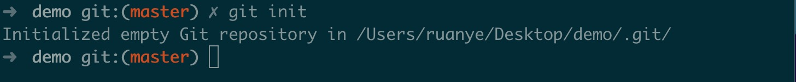
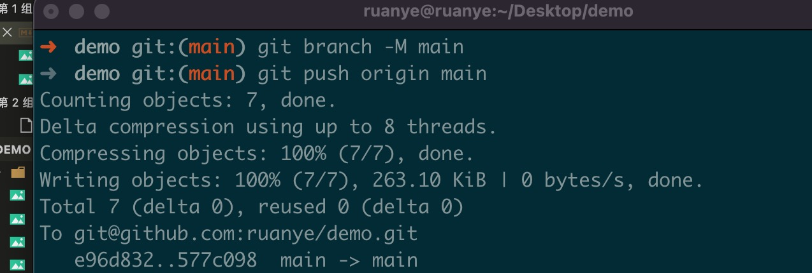
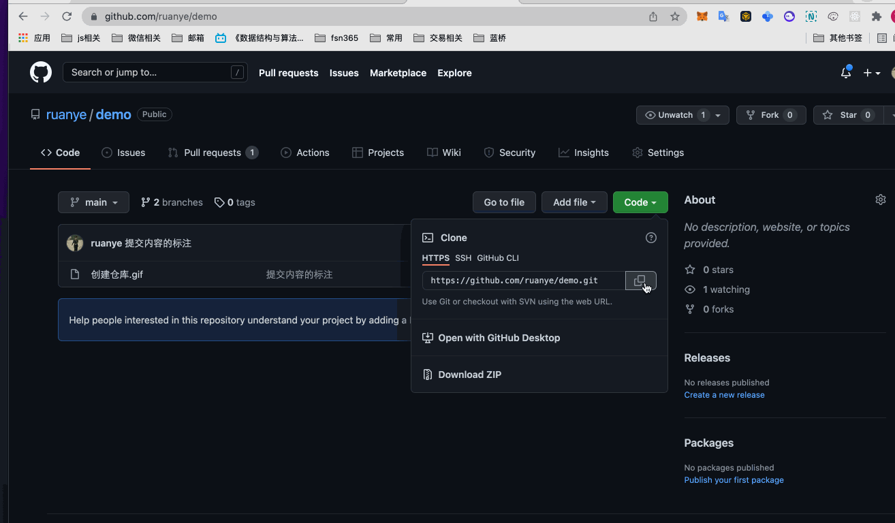
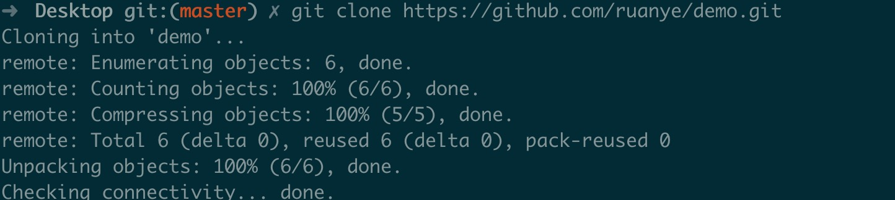
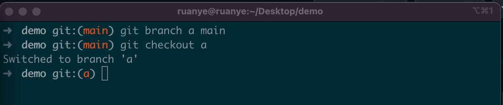
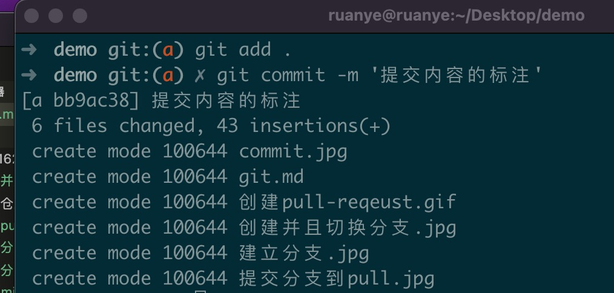
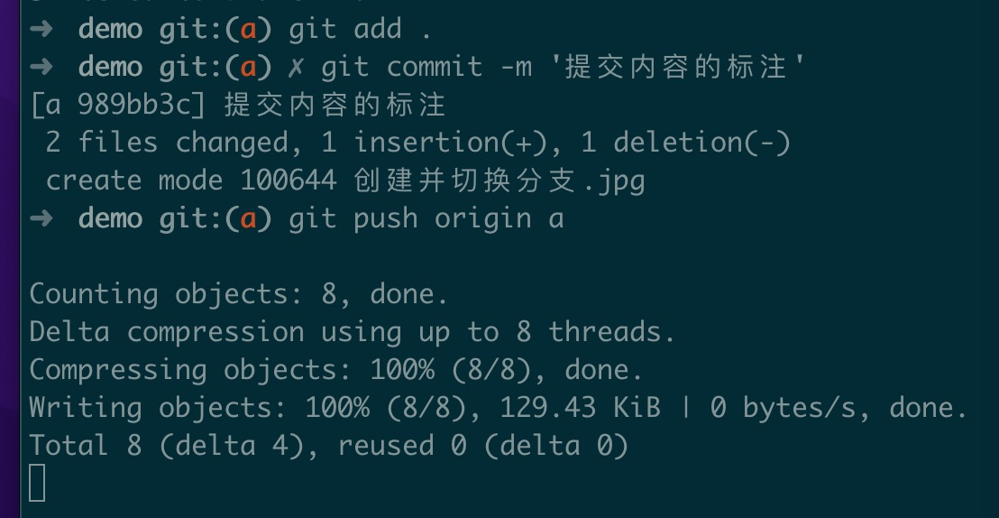

## git 无仓库新建仓库提交流程 

1. cd 进入文件夹目录,执行 git init 命令

git init  # 初始化仓库

2. 添加仓库地址

git remote add origin git@github.com:ruanye/demo.git

3. 提交文件到缓存去。 告诉 git 需要提交什么   . 表示全部文件  

git add . 

4. 提交文件到 git 仓库 

git commit -m "提交内容的标注"    

提交内容的标注和代码中的注释差不多，告诉 git 提交的内容是什么

5. 设置默认分支名 

git branch -M main

6. 推送到远程仓库

git push -u origin main

## git 已有仓库 pull request 流程 (以 a 分支为例)

1. 拉取仓库 (只需要拉取一次)

git clone git@github.com:ruanye/demo.git

git clone 后面加上仓库地址即可拉取仓库 

2. 创建并且切换到分支
git branch a main  # 创建分支 a为分支名  main 为基于谁建立的 a 分支
git checkout -a    # 切换到分支 a

3. 可以在当前修改或者新增文件，然后执行以下命名  
 

4. 提交分支到远程仓库

5. 创建 pull request 

git push origin a # 提交 a 分支到远程仓库

